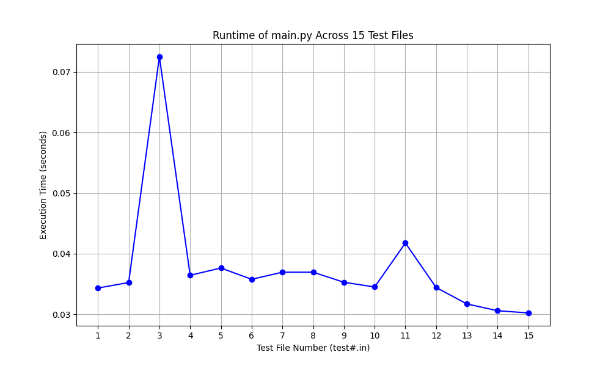

# Programming Assignment 3
Name: Jonathan Docteur

UFID: 20036429
## Prerequisites and Dependencies
To run the code and visualize the results, ensure you have the following:
- **Python 3.x+**
- **Matplotlib**
  ```bash
  pip install matplotlib
  ```

## Compilation / Build Instructions
Clone the repository and run scripts

```bash
git clone <repository_url>
cd "Programming Assignment 3"
```

## How to Run (Commands)

To run (`main.py`) against a single test input:
```bash
python source/main.py < q1-tests/test1.in
```

To run (`q1.py`), which will process all 15 test files and graph the runtimes:
```bash
python source/q1.py
```

To run all tests and diff against expected output:

```bash
bash run_tests.sh
```


# Questions

## Question 1: Empirical Comparison

## Question 2: Recurrence Equation

Let m= |A|, n=|B|

Let v(c) be the nonnegative integer value assigned to character c.

dp[i][j] = the maximum value of any common subsequence between the string prefixes A[1..i] and B[1..j].

**Base Cases**

dp[i][0] = 0 for all 0 ≤ i ≤ m

dp[0][j] = 0 for all 0 ≤ j ≤ n

(LCS between any string and an empty string is  an empty string. Thus, total value is 0.)

Recurrence for 1 <= i <= m and 1 <= j <= n
```
    if A[i] == B[j]:
        dp[i][j] = dp[i-1][j-1] + v(A[i])

    if A[i] != B[j]:
        dp[i][j] = max(dp[i-1][j],  dp[i][j-1])
```
 The recurrence works by finding the optimal choice at the end of the prefixes A[1..i] and B[1..j]. Characters that do not match (A[i] !=B[j]) cannot both be part of the final matched pair. The optimal common subsequence must come from either ignoring the last character of A or ignoring the last character of B so we take the max value of the two. If the characters do match (A[i]==B[j]), since the problem specifies that all character values are nonnegative (v(c)≥0), it is always mathematically optimal to pair them together. We match these two characters and add their associated value, v(A[i]), to the best possible score of the prefixes immediately preceding them (dp[i−1][j−1]). Building upon these optimal subproblems throughout the grid leads to the final overall max value calculated and located at dp[m][n].

## Question 3: Big-Oh

The runtime of the following algorithm is O ( m x n). 
Why? Nested loop. The outer loop runs m times and the inner loop runs n times, resulting in m x n total iterations.
```
function HVLCS(A, B, v):
    m = length(A)
    n = length(B)
    
    let dp be a new matrix of size (m+1) by (n+1) filled with 0
    
    for i from 1 to m:
        for j from 1 to n:
            if A[i] == B[j]:
                dp[i][j] = dp[i-1][j-1] + v(A[i])
            else:
                dp[i][j] = max(dp[i-1][j], dp[i][j-1])
                
    return dp[m][n]
```
